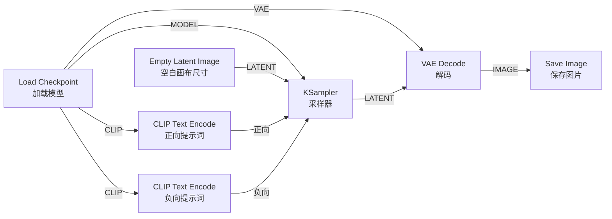

# ComfyUI 零基础完全使用文档

> 本文档面向**完全没接触过 ComfyUI 的初学者**。从「它是什么」一直讲到「能独立做出第一张图、第一段视频」，每一步都有解释。
> 不需要任何编程基础，跟着做即可。

---

## 目录

1. [ComfyUI 是什么](#一comfyui-是什么)
2. [核心概念：节点和工作流](#二核心概念节点和工作流)
3. [安装与启动](#三安装与启动)
4. [界面导览](#四界面导览)
5. [第一个工作流：文字生成图片](#五第一个工作流文字生成图片)
6. [读懂每一个节点](#六读懂每一个节点在做什么)
7. [模型从哪来、放哪里](#七模型从哪来放哪里)
8. [常用操作与快捷键](#八常用操作与快捷键)
9. [进阶玩法](#九进阶玩法)
10. [生成视频（Wan 2.2）](#十生成视频wan-22)
11. [常见问题排查](#十一常见问题排查)
12. [启动参数速查表](#十二启动参数速查表)
13. [名词小词典（完整版）](#十三名词小词典完整版)
  - [13.5 视频通用参数](#135-视频生成通用参数-)
    - [13.6 文生视频 T2V](#136-文生视频-t2vtext-to-video专用-)
    - [13.7 图生视频 I2V](#137-图生视频-i2vimage-to-video专用-)
    - [13.8 Wan 2.2 专用](#138-wan-22-专用名词)
    - [13.13 视频参数调优速查卡](#1313-参数调优速查卡视频)

---

## 一、ComfyUI 是什么

ComfyUI 是一个**用 AI 生成图片、视频、音频、3D 模型的工具**。

它最大的特点是用**「搭积木」的方式**来工作：你把一个个功能方块（叫**节点**）用线连起来，组成一条「生产流水线」，点击运行，AI 就按这条流水线产出结果。

打个比方：

- 传统工具像「自动贩卖机」——按一个按钮，出一个固定的东西。
- ComfyUI 像「乐高积木」——你可以自由拼装，想怎么改流程都行，控制力极强。

**优点**：灵活、可控、能复现、能做别的工具做不到的复杂流程。
**代价**：第一次看会觉得复杂。但跟着本文做完一遍，你就懂了。

---

## 二、核心概念：节点和工作流

只需要记住 3 个词：

### 1. 节点（Node）

一个**功能方块**。比如：

- 「加载模型」是一个节点
- 「输入提示词」是一个节点
- 「保存图片」是一个节点

每个节点左边是**输入**（接收数据），右边是**输出**（产出数据）。

```
        ┌─────────────────┐
输入 →  │   节点（功能）   │  → 输出
        └─────────────────┘
```

### 2. 连线（Link）

把一个节点的**输出**，连到另一个节点的**输入**，数据就从前者流向后者。

ComfyUI 用**颜色**区分数据类型，只有同色（同类型）的点才能连：


| 颜色  | 数据类型         | 含义                |
| --- | ------------ | ----------------- |
| 紫色  | MODEL        | 模型本体              |
| 黄色  | CLIP         | 文字理解模块            |
| 红色  | VAE          | 图像「编解码器」          |
| 橙色  | CONDITIONING | 提示词编码后的结果         |
| 粉色  | LATENT       | 潜空间（AI 内部的「半成品图」） |
| 蓝色  | IMAGE        | 最终图片              |


> 不用背，连错了它会自动拒绝，连对了才会吸附上去。

### 3. 工作流（Workflow）

所有节点 + 所有连线组成的整张图，就是一个**工作流**。它可以保存成 `.json` 文件，发给别人，别人加载后能得到完全一样的流程。

> 神奇之处：ComfyUI 生成的 PNG 图片里**藏着**完整工作流。把别人发的图拖进 ComfyUI，就能还原出他用的全部流程和参数。

---

## 三、安装与启动

> 你的电脑上 ComfyUI 已在 `ai-videos/ComfyUI`。如果是全新环境，按下面来。

### 方式 A：最简单（适合纯新手）

去官网 [https://www.comfy.org/download](https://www.comfy.org/download) 下载**桌面版**（Windows / macOS），双击安装，像普通软件一样打开即可。

### 方式 B：手动安装（你当前是这种，适合 Linux / 服务器）

**第 1 步：确认有 Python（3.10 ~ 3.12 较稳）**

```bash
python --version
```

**第 2 步：安装 PyTorch（要按你的显卡选）**

- NVIDIA 显卡：去 [https://pytorch.org/get-started/locally/](https://pytorch.org/get-started/locally/) 选对应 CUDA 版本的命令
- 没有独立显卡：装 CPU 版（能跑但很慢）

**第 3 步：安装 ComfyUI 依赖**

```bash
cd /mnt/ddr2/qxk/workspace/ai-videos/ComfyUI
pip install -r requirements.txt
```

**第 4 步：启动**

```bash
python main.py
```

启动成功后，终端会显示类似：

```
To see the GUI go to: http://127.0.0.1:8188
```

**第 5 步：打开浏览器**，访问 [http://127.0.0.1:8188](http://127.0.0.1:8188) 就能看到界面。

### 常用启动写法

```bash
# 默认启动（只有本机能访问）
python main.py

# 让局域网/其他设备也能访问（比如服务器）
python main.py --listen 0.0.0.0 --port 8188

# 显存很小（比如 4GB 以下）时，省显存模式
python main.py --lowvram

# 完全没有显卡，用 CPU 跑（慢）
python main.py --cpu

# 启动后自动打开浏览器
python main.py --auto-launch
```

> 更多参数见文末的[启动参数速查表](#十二启动参数速查表)。

---

## 四、界面导览

打开后你会看到一块**黑色画布**，上面已经摆好了一个默认工作流。

```
┌────────────────────────────────────────────────────────┐
│  顶部菜单：保存/加载/设置                                 │
│                                                          │
│   ┌──────────┐   ┌──────────┐   ┌──────────┐            │
│   │ 加载模型  │──▶│ 提示词    │──▶│ 采样器    │──▶ ...     │
│   └──────────┘   └──────────┘   └──────────┘            │
│                  ← 节点画布（可拖动、缩放）→              │
│                                                          │
│                                   ┌──────────────┐       │
│                                   │ ▶ 运行队列    │       │
│                                   └──────────────┘       │
└────────────────────────────────────────────────────────┘
```

**基本操作：**

- **拖动画布**：按住鼠标空白处拖，或按住空格 + 移动鼠标
- **缩放**：滚轮
- **移动节点**：拖节点标题栏
- **连线**：从一个节点右边的小圆点拖到另一个节点左边的小圆点
- **新建节点**：在空白处**双击**，弹出搜索框，输入名字找节点
- **运行**：点「Queue（队列）」按钮，或按 `Ctrl + Enter`

---

## 五、第一个工作流：文字生成图片

ComfyUI 自带默认工作流就是「文生图」。如果画布是空的，按 `Ctrl + D` 加载默认工作流。

它由这几个节点组成，数据从左流到右：




### 操作步骤

1. **选模型**：在 `Load Checkpoint` 节点里，从下拉框选一个模型文件（前提是 `models/checkpoints/` 里已经放了模型，见[第七节](#七模型从哪来放哪里)）。
2. **写正向提示词**：在上面那个 `CLIP Text Encode` 里，写你**想要**的东西，例如：
  ```
   a cute cat sitting on a sofa, sunlight, high quality
   （一只可爱的猫坐在沙发上，阳光，高质量）
  ```
3. **写负向提示词**：下面那个 `CLIP Text Encode` 里写你**不想要**的东西，例如：
  ```
   blurry, low quality, deformed
   （模糊、低质量、畸形）
  ```
4. **设置尺寸**：在 `Empty Latent Image` 里设置 `width`（宽）和 `height`（高），新手用 `512x512` 或 `1024x1024`。
5. **点运行**：按 `Ctrl + Enter`。
6. **看结果**：稍等片刻，图片会出现在 `Save Image` 节点里，同时自动保存到 `output/` 文件夹。

🎉 恭喜，你已经会用 ComfyUI 生成图片了。

---

## 六、读懂每一个节点在做什么

理解了原理，你才能自由调整。下面解释默认工作流每个节点。

### ① Load Checkpoint（加载模型）

读取一个大模型文件（`.safetensors`）。它一次性吐出三样东西：

- **MODEL**：负责「画画」的主模型
- **CLIP**：负责「读懂你文字」的模块
- **VAE**：负责把 AI 内部数据转成真正图片的「翻译官」

### ② CLIP Text Encode（提示词编码）

把你写的文字，通过 CLIP 翻译成 AI 能理解的「数学描述」（CONDITIONING）。

- 一个接**正向**（想要的）
- 一个接**负向**（不想要的）

### ③ Empty Latent Image（空白潜空间图）

创建一张「空白草稿」，决定最终图片的**尺寸**和**一次生成几张**（batch_size）。

> 「潜空间（Latent）」可以理解成 AI 内部的草稿格式，比真实图片小很多，算起来快。

### ④ KSampler（采样器）⭐ 最关键

这是真正「作画」的地方。它拿着模型、正负提示词、空白草稿，一步步「去噪」画出图。重要参数：


| 参数               | 作用                | 新手建议                 |
| ---------------- | ----------------- | -------------------- |
| **seed**         | 随机种子，决定画面随机性      | 固定它能复现同一张图           |
| **steps**        | 步数，画多少步           | 20~30                |
| **cfg**          | 提示词服从度，越高越听话但可能僵硬 | 7~8                  |
| **sampler_name** | 采样算法              | `euler` 或 `dpmpp_2m` |
| **scheduler**    | 步数节奏              | `normal` 或 `karras`  |
| **denoise**      | 去噪强度              | 文生图填 1.0             |


### ⑤ VAE Decode（VAE 解码）

把 KSampler 产出的潜空间「草稿」翻译成肉眼能看的真实图片。

### ⑥ Save Image（保存图片）

显示并保存图片到 `output/`。文件名前缀可改。

> 想生成后不保存只预览，可换成 `Preview Image` 节点。

---

## 七、模型从哪来、放哪里

ComfyUI **不自带**大模型，需要你自己下载放进对应文件夹。

### 去哪下载

- **Hugging Face**：[https://huggingface.co](https://huggingface.co)
- **Civitai**：[https://civitai.com](https://civitai.com)（社区模型多）

下载格式优先选 `**.safetensors`**（安全、通用）。

### 放哪个文件夹

模型目录在 `ComfyUI/models/`，按类型分类：


| 文件夹                        | 放什么                            |
| -------------------------- | ------------------------------ |
| `models/checkpoints/`      | **主模型**（最常用，如 SD1.5、SDXL、Flux） |
| `models/loras/`            | LoRA（小型风格/角色微调）                |
| `models/vae/`              | 单独的 VAE 文件                     |
| `models/controlnet/`       | ControlNet（姿势/线稿控制）            |
| `models/text_encoders/`    | 文本编码器（部分新模型需要）                 |
| `models/diffusion_models/` | 单独的扩散模型权重                      |
| `models/upscale_models/`   | 放大模型（如 ESRGAN）                 |
| `models/embeddings/`       | 嵌入 / Textual Inversion         |


> 放好文件后，回到界面按 `R` 刷新，或在节点下拉框重新点开，就能看到新模型。

### 新手第一个模型建议

- 想要**简单快速**：下载 **SD1.5** 系列（小、快、显存友好）
- 想要**高质量**：下载 **SDXL** 或 **Flux**（大、慢、需要较多显存）

---

## 八、常用操作与快捷键


| 快捷键                     | 作用                |
| ----------------------- | ----------------- |
| `Ctrl + Enter`          | 运行（加入队列）          |
| `Ctrl + Shift + Enter`  | 插队优先运行            |
| `Ctrl + Alt + Enter`    | 取消当前生成            |
| `Ctrl + S`              | 保存工作流             |
| `Ctrl + O`              | 打开工作流文件           |
| `Ctrl + D`              | 加载默认工作流           |
| `Ctrl + Z` / `Ctrl + Y` | 撤销 / 重做           |
| `Ctrl + C` / `Ctrl + V` | 复制 / 粘贴节点         |
| 双击空白处                   | 搜索并添加节点           |
| `Ctrl + M`              | 静音节点（暂时跳过它）       |
| `Ctrl + B`              | 旁路节点（当它不存在，线自动接通） |
| `Ctrl + G`              | 把选中节点打组           |
| 拖动节点右下角                 | 调整节点大小            |
| `Delete`                | 删除选中节点            |


> 小技巧：右键节点有丰富菜单（转换参数为输入、添加备注、改颜色等）。

---

## 九、进阶玩法

当你熟悉基础后，可以尝试：

### 1. LoRA（风格/角色微调）

加一个 `Load LoRA` 节点，串在模型和采样器之间，就能给画面加上特定画风或角色。

### 2. 高清放大（Hires Fix）

先生成小图，再用第二个 KSampler + 放大节点把图变大变精细，是出高清图的常用套路。

### 3. ControlNet（精确控制构图）

用一张「姿势图 / 线稿 / 深度图」来约束生成，让人物摆出你指定的姿势。需要 `models/controlnet/` 里的模型。

### 4. Inpainting（局部重绘）

只重画图片的一部分（比如换个表情、去掉杂物），其余保持不变。

### 5. 用模板快速上手

ComfyUI 自带大量现成模板。你本地在 `ComfyUI/blueprints/` 目录，有近 90 个 `.json`，例如：

- `Text to Image (Flux.1 Dev).json`
- `Image Inpainting (Qwen-image).json`
- `Text to Video (Wan 2.2).json`

直接用 `Ctrl + O` 打开这些文件，就能加载一条完整流程，改改提示词即可用。

> 强烈建议初学者**多打开模板研究**，比从零搭快得多。

---

## 十、生成视频（Wan 2.2）

你的工作区里有 Wan 2.2 视频模型相关内容，这里单独说一下。

### 在 ComfyUI 里做

1. 用 `Ctrl + O` 打开 `ComfyUI/blueprints/Text to Video (Wan 2.2).json`
2. 确认所需模型已放进 `models/`（Wan 视频模型通常需要 diffusion model + VAE + text encoder 三件套，缺哪个节点会标红）
3. 在提示词节点里写画面描述，设置 `length`（帧数 / 时长）、`width`、`height`
4. `Ctrl + Enter` 运行，结果视频保存到 `output/`

> 视频比图片**慢得多、吃显存多得多**。新手先用低分辨率、短帧数试跑。

### 视频相关节点在哪

视频功能由 `comfy_extras/nodes_wan.py`、`nodes_video.py` 等提供，启动时自动加载，你在节点搜索里直接搜 "Wan" / "Video" 即可。

---

## 十一、常见问题排查

### Q1：节点变红 / 报错

**原因**：通常是**缺模型**或**缺自定义节点**。

- 缺模型：把对应模型下载放进 `models/` 对应子目录。
- 缺节点：说明这个工作流用了第三方扩展，需要装对应 custom node（见下）。

### Q2：提示 "xxx not found" 找不到模型

模型没放对文件夹，或放完没刷新。检查路径，然后按 `R` 刷新。

### Q3：显存不足（CUDA out of memory）

- 调小图片尺寸 / 帧数 / batch_size
- 启动时加 `--lowvram` 或 `--novram`
- 用更小的模型（SD1.5 比 SDXL/Flux 省很多）

### Q4：生成特别慢

- 没显卡用 CPU 会非常慢，属正常
- 视频本身就慢，先小尺寸试
- 检查是不是误用了 `--cpu`

### Q5：图片是黑的

某些 VAE 在 fp16 下会出黑图，启动时试试 `--fp32-vae`。

### Q6：想安装社区插件（自定义节点）

最推荐装 **ComfyUI-Manager**：它能在界面里一键搜索、安装缺失节点和模型。

- 手动方式：把插件仓库放到 `ComfyUI/custom_nodes/` 下，重启即可。
- 启动时加 `--enable-manager` 可启用内置 Manager 功能。

### Q7：怎么复现别人的图

把别人发的**原图 PNG** 直接拖进 ComfyUI 画布，工作流和参数会自动还原（前提你也有对应模型）。

---

## 十二、启动参数速查表

> 用法：`python main.py 参数1 参数2 ...`

### 网络 / 访问


| 参数                     | 作用              |
| ---------------------- | --------------- |
| `--listen 0.0.0.0`     | 允许其他设备访问（默认只本机） |
| `--port 8188`          | 指定端口            |
| `--auto-launch`        | 启动后自动开浏览器       |
| `--enable-cors-header` | 允许跨域访问          |


### 显存 / 性能


| 参数                 | 作用                 |
| ------------------ | ------------------ |
| `--cpu`            | 全部用 CPU（无显卡时，慢）    |
| `--lowvram`        | 低显存模式              |
| `--novram`         | 极低显存（比 lowvram 更省） |
| `--highvram`       | 大显存，模型常驻显存提速       |
| `--gpu-only`       | 所有东西都放 GPU         |
| `--reserve-vram 2` | 给系统保留 2GB 显存       |
| `--fast`           | 启用激进优化（可能影响质量/稳定）  |


### 精度（出问题时再调）


| 参数                  | 作用             |
| ------------------- | -------------- |
| `--fp32-vae`        | VAE 用 fp32，修黑图 |
| `--force-fp16`      | 强制 fp16        |
| `--fp8_e4m3fn-unet` | 模型用 fp8 存储，省显存 |


### 目录


| 参数                                    | 作用                         |
| ------------------------------------- | -------------------------- |
| `--base-directory 路径`                 | 改 models/input/output 等总目录 |
| `--output-directory 路径`               | 单独改输出目录                    |
| `--extra-model-paths-config xxx.yaml` | 额外模型搜索路径                   |


### 功能开关


| 参数                           | 作用                   |
| ---------------------------- | -------------------- |
| `--disable-api-nodes`        | 禁用云端 API 节点（纯离线）     |
| `--disable-all-custom-nodes` | 不加载任何第三方节点（排查问题用）    |
| `--enable-manager`           | 启用内置 ComfyUI-Manager |
| `--preview-method auto`      | 生成时显示中间预览            |


---

## 十三、名词小词典（完整版）

> 按类别整理。遇到不懂的参数，先在这里查；视频相关重点看 **13.5 ~ 13.8**。

---

### 13.1 基础概念


| 名词                 | 通俗解释                                 |
| ------------------ | ------------------------------------ |
| **ComfyUI**        | 用节点图搭 AI 生成流水线的工具，支持图/视频/音频/3D       |
| **节点 Node**        | 画布上的一个功能方块，有输入口和输出口                  |
| **连线 Link**        | 把两个节点连起来，数据从左流到右                     |
| **工作流 Workflow**   | 所有节点 + 连线组成的完整流程，可保存为 `.json`        |
| **Blueprint / 模板** | 官方预置好的工作流，打开就能用                      |
| **Subgraph / 子图**  | 把多个节点打包成一个「大节点」，方便复用                 |
| **Queue / 队列**     | 待执行的任务列表，按顺序跑                        |
| **Prompt（提示词）**    | 描述画面的文字；分正向（想要的）和负向（不想要的）            |
| **Custom Node**    | 第三方扩展节点，装到 `custom_nodes/` 目录        |
| **App Mode**       | 把复杂工作流简化成几个输入框的界面模式                  |
| **API Prompt**     | 给程序调用的 JSON 格式工作流（File → Export API） |


---

### 13.2 数据类型（连线颜色）


| 类型               | 含义      | 常见用途           |
| ---------------- | ------- | -------------- |
| **MODEL**        | 扩散主模型   | 采样器输入          |
| **CLIP**         | 文本编码器   | 编码提示词          |
| **VAE**          | 图像编解码器  | 潜空间 ↔ 真实图像/视频帧 |
| **CONDITIONING** | 条件向量    | 正负提示词编码结果      |
| **LATENT**       | 潜空间数据   | 采样过程中的「草稿」     |
| **IMAGE**        | 单张或多张图片 | 输入图、输出帧序列      |
| **MASK**         | 黑白遮罩    | 指定哪些区域要改       |
| **VIDEO**        | 视频对象    | 帧序列 + 可选音频     |
| **AUDIO**        | 音频数据    | 配乐、配音          |
| **CLIP_VISION**  | 图像理解输出  | 图生视频时理解参考图内容   |


---

### 13.3 模型与权重


| 名词                         | 通俗解释                                  |
| -------------------------- | ------------------------------------- |
| **Checkpoint / ckpt**      | 一体化大模型，含 UNet + CLIP + VAE（或部分组件）     |
| **UNet / Diffusion Model** | 真正做「去噪生成」的核心网络，视频模型常单独存放              |
| **Text Encoder / 文本编码器**   | 把文字变成向量；Wan 用 **UMT5**                |
| **VAE**                    | Variational AutoEncoder，在像素空间和潜空间之间转换 |
| **safetensors**            | 安全的模型权重格式，优先用这个                       |
| **LoRA**                   | 小型微调插件，给模型加风格/能力，文件小、可叠加              |
| **LoRA strength / 强度**     | LoRA 影响力度，1.0=满强度，0=无效                |
| **Embedding / 嵌入**         | 用几个词代表特定概念的小文件                        |
| **Hypernetwork**           | 另一种轻量微调方式，现在较少用                       |
| **ControlNet**             | 用参考图（姿势/深度/线稿等）控制生成结构                 |
| **IP-Adapter**             | 用参考图控制风格或内容，不必写进提示词                   |
| **Model Merge / 模型合并**     | 把两个模型的权重按比例混合                         |
| **fp8 / fp16 / bf32**      | 数值精度；fp8 最省显存，fp32 最精确                |
| **Quantization / 量化**      | 把模型权重压缩成低精度以省显存                       |
| **High Noise Model**       | Wan 2.2 的高噪声阶段模型，负责构图和大结构             |
| **Low Noise Model**        | Wan 2.2 的低噪声阶段模型，负责细节精修               |
| **LightX2V LoRA**          | Wan 专用加速 LoRA，把步数压到 4 步左右             |


---

### 13.4 图像生成核心参数


| 参数                    | 含义                              | 新手建议                                |
| --------------------- | ------------------------------- | ----------------------------------- |
| **width / height**    | 输出宽和高（像素）                       | SD1.5 用 512；SDXL 用 1024；需为 8 的倍数    |
| **batch_size**        | 一次生成几张                          | 显存够再加大，默认 1                         |
| **seed / noise_seed** | 随机种子，决定噪声初始状态                   | 固定=可复现；`randomize`=每次不同             |
| **steps**             | 采样步数                            | 文生图 20~30；Wan 加速模板常用 4              |
| **cfg / CFG Scale**   | Classifier-Free Guidance，提示词服从度 | 文生图 7~8；Wan 2.2 模板常用 **1**（配合双阶段采样） |
| **sampler_name**      | 采样算法                            | `euler`、`dpmpp_2m`、`uni_pc` 等       |
| **scheduler**         | 噪声衰减节奏                          | `normal`、`karras`、`simple` 等        |
| **denoise**           | 去噪强度，0~1                        | 文生图=1.0；图生图=0.3~0.7 保留原图结构          |
| **shift**             | ModelSamplingSD3 的偏移参数          | Wan 2.2 模板默认 **5.0**，影响采样分布         |


#### 采样器 Sampler 常见算法


| 名称                  | 特点           |
| ------------------- | ------------ |
| **euler**           | 简单快速，新手友好    |
| **euler_ancestral** | 每步带随机性，细节更丰富 |
| **dpmpp_2m**        | 质量与速度平衡，常用   |
| **dpmpp_sde**       | 质量高，稍慢       |
| **uni_pc**          | 步数少时效果较好     |
| **ddim**            | 经典算法，可确定性采样  |


#### Scheduler 常见选项


| 名称              | 特点           |
| --------------- | ------------ |
| **normal**      | 默认线性衰减       |
| **karras**      | 后期去噪更细，细节好   |
| **simple**      | Wan 2.2 模板常用 |
| **sgm_uniform** | 均匀步长         |
| **exponential** | 指数衰减         |


---

### 13.5 视频生成通用参数 ⭐


| 参数                          | 含义                   | 说明与建议                                                          |
| --------------------------- | -------------------- | -------------------------------------------------------------- |
| **length**                  | 视频总帧数（不是秒数！）         | Wan 默认 **81** 帧；必须满足 `(length - 1) % 4 == 0`，即 1、5、9、13…81、85… |
| **fps**                     | 每秒播放多少帧              | CreateVideo 节点设置；Wan 模板默认 **16 fps**；81 帧 ÷ 16 ≈ **5 秒**       |
| **width / height**          | 视频分辨率                | Wan T2V 模板默认 640×640；I2V 常用 832×480；需为 16 的倍数                  |
| **batch_size**              | 一次生成几条视频             | 默认 1；视频极吃显存，不建议加大                                              |
| **VIDEO**                   | 视频数据类型               | 由 CreateVideo 节点产出，SaveVideo 保存                                |
| **CreateVideo**             | 把帧序列（IMAGE）打包成 VIDEO | 需指定 fps，可选接 audio                                              |
| **SaveVideo**               | 保存视频文件到 output/      | 支持 mp4 等格式                                                     |
| **VAEDecode**               | 把潜空间解码成每一帧图像         | 视频 = 多张 IMAGE 帧                                                |
| **EmptyHunyuanLatentVideo** | 创建空白视频潜空间            | 文生视频起点，填 width/height/length                                   |
| **Frame / 帧**               | 视频的一格画面              | 24fps = 每秒 24 帧                                                |
| **Temporal / 时序**           | 帧与帧之间的时间连贯性          | 视频模型比图片模型多这一维度                                                 |
| **Context Window**          | 分段生成长视频的窗口大小         | 超长视频常分段生成再拼接                                                   |


#### length 与时长换算

```
视频时长（秒）≈ length ÷ fps

示例（Wan 2.2 默认）：
  length=81, fps=16  →  81÷16 ≈ 5.06 秒
  length=49, fps=16  →  49÷16 ≈ 3.06 秒
  length=81, fps=24  →  81÷24 ≈ 3.38 秒
```

#### 分辨率与显存（经验值）


| 分辨率      | length | 大致难度              |
| -------- | ------ | ----------------- |
| 640×640  | 81     | 中等（你有 96GB 显卡很轻松） |
| 832×480  | 81     | 中等                |
| 1280×720 | 81     | 较高                |
| 640×640  | 129+   | 长视频，显存和时间显著增加     |


---

### 13.6 文生视频 T2V（Text-to-Video）专用 ⭐

**定义**：只输入**文字提示词**，从纯噪声生成视频，不需要参考图。


| 名词 / 参数                        | 含义                                             |
| ------------------------------ | ---------------------------------------------- |
| **T2V / Text-to-Video**        | 文生视频                                           |
| **EmptyHunyuanLatentVideo**    | 创建全噪声的视频潜空间，T2V 的起点                            |
| **Wan T2V 双阶段采样**              | 先用 High Noise 模型跑前几步，再用 Low Noise 模型跑后几步       |
| **High Noise 阶段**              | 负责整体构图、运动方向、大色块（Wan 模板：step 0→2）               |
| **Low Noise 阶段**               | 负责细节、纹理、面部清晰（Wan 模板：step 2→4）                  |
| **KSamplerAdvanced**           | 高级采样器，可指定 `start_at_step` / `end_at_step` 做分阶段 |
| **start_at_step**              | 从第几步开始采样（0=从头）                                 |
| **end_at_step**                | 到第几步结束（4=四步全跑完）                                |
| **add_noise**                  | 是否在本阶段添加噪声；第一阶段 enable，第二阶段 disable            |
| **return_with_leftover_noise** | 是否保留剩余噪声给下一阶段；第一阶段 enable                      |
| **LightX2V 4steps LoRA**       | 配合双阶段，总共只需 **4 步** 出视频                         |


#### Wan 2.2 T2V 模板默认参数速查


| 参数             | 默认值              | 说明                 |
| -------------- | ---------------- | ------------------ |
| text           | （空，需自己填）         | 正向提示词              |
| length         | **81**           | 约 5 秒（16fps）       |
| width × height | **640 × 640**    | 正方形视频              |
| fps            | **16**           | 播放帧率               |
| steps（每阶段）     | **4**（总计 4 步分两段） | High: 0→2，Low: 2→4 |
| cfg            | **1**            | Wan 双阶段时通常很低       |
| sampler        | **euler**        |                    |
| scheduler      | **simple**       |                    |
| shift          | **5.0**          | ModelSamplingSD3   |
| noise_seed     | randomize        | 每次不同               |


#### T2V 提示词写法建议

```
结构：[主体] + [动作/运动] + [场景/环境] + [镜头/风格] + [质量词]

示例：
  A young woman walking slowly through a cherry blossom forest,
  petals falling in the wind, cinematic lighting, smooth camera pan,
  high quality, 4k

注意：
  - 一定要写「动作/运动」，否则画面可能几乎不动
  - 可加 camera pan / zoom in / tracking shot 描述镜头
  - 负向提示词：blurry, static, low quality, distorted face
```

---

### 13.7 图生视频 I2V（Image-to-Video）专用 ⭐

**定义**：输入一张**起始参考图**，让 AI 以这张图为基础「动起来」生成后续帧。


| 名词 / 参数                       | 含义                              |
| ----------------------------- | ------------------------------- |
| **I2V / Image-to-Video**      | 图生视频                            |
| **start_image**               | 起始帧参考图，视频第一帧会尽量贴近它              |
| **WanImageToVideo**           | Wan 专用 I2V 条件节点，接收 start_image  |
| **clip_vision_output**        | CLIP Vision 对参考图的理解，增强内容一致性     |
| **concat_latent_image**       | 把起始图编码进潜空间，作为生成的「锚点」            |
| **concat_mask**               | 标记哪些帧/区域由参考图约束（起始帧 mask=0 表示锁定） |
| **First-Last-Frame to Video** | 首尾帧生视频：给开始图 + 结束图，中间过渡          |
| **end_image**                 | 结束帧参考图（首尾帧模式用）                  |
| **reference_image**           | 角色/物体参考图，保持身份一致                 |
| **control_video**             | 控制视频（姿势/深度等），引导运动方式             |
| **pose_video**                | 姿态序列视频，驱动人物动作                   |
| **face_video**                | 面部视频，驱动表情（Wan Animate 等）        |
| **video_frame_offset**        | 视频帧偏移，用于分段拼接长视频                 |


#### I2V vs T2V 核心区别


| 对比项  | T2V 文生视频                | I2V 图生视频            |
| ---- | ----------------------- | ------------------- |
| 输入   | 只要文字                    | 文字 + **起始图**（必须）    |
| 第一帧  | AI 自由发挥                 | **贴近 start_image**  |
| 节点   | EmptyHunyuanLatentVideo | **WanImageToVideo** |
| 模型文件 | `wan2.2_t2v_`*          | `wan2.2_i2v_`*      |
| LoRA | `t2v_lightx2v_*`        | `i2v_lightx2v_*`    |
| 适用场景 | 完全凭空创作                  | 让人物/场景「动起来」         |


#### I2V 使用建议

```
1. start_image 选清晰、主体明确的图（人物正面、物体居中）
2. 提示词重点写「怎么动」，而不是重复描述图里已有的东西
   例：图是一女孩站着 → 提示词写 "she slowly turns her head and smiles, hair flowing in wind"
3. 分辨率尽量与 start_image 比例一致，避免拉伸变形
4. cfg 仍建议偏低（~1），配合双阶段采样
```

---

### 13.8 Wan 2.2 专用名词


| 名词                           | 通俗解释                                  |
| ---------------------------- | ------------------------------------- |
| **Wan / 万相**                 | 阿里开源的视频生成模型系列                         |
| **Wan 2.1 / 2.2**            | 版本号；2.2 支持 T2V、I2V、首尾帧等               |
| **UMT5 XXL**                 | Wan 使用的超大文本编码器，理解长提示词                 |
| **wan_2.1_vae.safetensors**  | Wan 专用 VAE，解码视频帧                      |
| **14B 模型**                   | 140 亿参数，分 high_noise / low_noise 两个文件 |
| **fp8_scaled**               | fp8 量化版，大幅省显存                         |
| **ModelSamplingSD3**         | 给模型加 shift 参数的采样包装节点                  |
| **WanVaceToVideo**           | VACE 视频编辑/修复（局部重绘、替换）                 |
| **WanAnimateToVideo**        | 用 pose/face 视频驱动角色动画                  |
| **WanFirstLastFrameToVideo** | 首尾帧控制过渡视频                             |
| **WanCameraImageToVideo**    | 带相机轨迹的图生视频                            |
| **WanTrackToVideo**          | 用轨迹点控制物体运动路径                          |
| **MoE（Mixture of Experts）**  | Wan 2.2 高/低噪声双模型架构                    |


#### Wan 2.2 所需模型文件清单


| 文件                                                 | 放哪里                        | 用途         |
| -------------------------------------------------- | -------------------------- | ---------- |
| `umt5_xxl_fp8_e4m3fn_scaled.safetensors`           | `models/text_encoders/`    | 文本编码       |
| `wan_2.1_vae.safetensors`                          | `models/vae/`              | 视频解码       |
| `wan2.2_t2v_high_noise_14B_fp8_scaled.safetensors` | `models/diffusion_models/` | T2V 高噪声    |
| `wan2.2_t2v_low_noise_14B_fp8_scaled.safetensors`  | `models/diffusion_models/` | T2V 低噪声    |
| `wan2.2_i2v_high_noise_14B_fp8_scaled.safetensors` | `models/diffusion_models/` | I2V 高噪声    |
| `wan2.2_i2v_low_noise_14B_fp8_scaled.safetensors`  | `models/diffusion_models/` | I2V 低噪声    |
| `wan2.2_*_lightx2v_4steps_lora_*.safetensors`      | `models/loras/`            | 4 步加速 LoRA |


---

### 13.9 控制、条件与编辑


| 名词                         | 通俗解释                         |
| -------------------------- | ---------------------------- |
| **Conditioning / 条件**      | 告诉 AI「要生成什么」的向量信息            |
| **Positive Conditioning**  | 正向条件（想要的）                    |
| **Negative Conditioning**  | 负向条件（不想要的）                   |
| **ControlNet**             | 用边缘/深度/姿态图精确控制结构             |
| **T2I-Adapter**            | 轻量版 ControlNet，更省资源          |
| **Canny**                  | 边缘检测控制                       |
| **Depth / 深度图**            | 控制前后景空间关系                    |
| **OpenPose / SDPose**      | 人体骨架姿势控制                     |
| **Inpainting / 局部重绘**      | 只改图中一部分                      |
| **Outpainting / 扩图**       | 向四周扩展画面                      |
| **Area Composition**       | 不同区域用不同提示词                   |
| **Differential Diffusion** | 按 mask 强度渐变重绘                |
| **GLIGEN**                 | 指定物体在画面中的位置框                 |
| **strength**               | 控制信号强度（ControlNet、VACE 等）bit |


---

### 13.10 后处理与输出


| 名词                            | 通俗解释                    |
| ----------------------------- | ----------------------- |
| **Upscale / 放大**              | 把图/视频分辨率变大              |
| **ESRGAN / SwinIR**           | 常用 AI 放大模型              |
| **Hires Fix**                 | 两阶段：先生成小图再放大精修          |
| **Frame Interpolation / 帧插值** | 在现有帧之间插入中间帧，让视频更流畅      |
| **Merge Videos**              | 把多段视频拼接成一条              |
| **Video Upscale**             | 视频逐帧或整体放大               |
| **crf**                       | 视频压缩质量参数，越小质量越高、文件越大    |
| **codec**                     | 视频编码格式，如 h264           |
| **bit_depth**                 | 色深，8bit 常规，16bit 更高色彩精度 |
| **filename_prefix**           | 输出文件名前缀                 |
| **Preview Image**             | 预览但不保存                  |
| **TAESD**                     | 轻量 VAE，用于采样过程中快速预览潜空间   |


---

### 13.11 界面与系统


| 名词                         | 通俗解释                     |
| -------------------------- | ------------------------ |
| **Mute / 静音节点**            | 跳过该节点，不执行（Ctrl+M）        |
| **Bypass / 旁路节点**          | 跳过但保持连线连通（Ctrl+B）        |
| **Group / 分组**             | 把多个节点框在一起（Ctrl+G）        |
| **Pin / 固定节点**             | 固定位置，批量移动时不跟着动           |
| **VRAM**                   | 显卡显存，视频生成的主要瓶颈           |
| **RAM**                    | 内存，模型 offload 时用         |
| **DynamicVRAM**            | ComfyUI 动态显存管理，自动加载/卸载模型 |
| **Offload**                | 把暂时不用的模型卸到 CPU 内存        |
| **--lowvram / --novram**   | 低显存启动模式                  |
| **--highvram**             | 模型常驻显存，速度更快              |
| **Queue**                  | 任务队列                     |
| **History**                | 历史生成记录                   |
| **Object Info**            | API 接口，返回所有节点定义          |
| **WebSocket**              | 实时推送进度和预览的连接方式           |
| **comfyui.db**             | 本地 SQLite 数据库，存用户/资产信息   |
| **extra_model_paths.yaml** | 额外模型搜索路径配置               |


---

### 13.12 常见缩写速查


| 缩写                | 全称                        | 含义        |
| ----------------- | ------------------------- | --------- |
| **T2I**           | Text-to-Image             | 文生图       |
| **I2I**           | Image-to-Image            | 图生图       |
| **T2V**           | Text-to-Video             | 文生视频      |
| **I2V**           | Image-to-Video            | 图生视频      |
| **V2V**           | Video-to-Video            | 视频生视频     |
| **FLF2V**         | First-Last-Frame to Video | 首尾帧生视频    |
| **CFG**           | Classifier-Free Guidance  | 提示词引导强度   |
| **VAE**           | Variational AutoEncoder   | 变分自编码器    |
| **UNet**          | U-Net                     | 扩散主网络结构   |
| **LoRA**          | Low-Rank Adaptation       | 低秩微调      |
| **SD**            | Stable Diffusion          | 经典扩散模型    |
| **SDXL**          | Stable Diffusion XL       | 大尺寸 SD 模型 |
| **fp8/fp16/bf16** | 浮点精度格式                    | 影响显存和速度   |
| **fps**           | Frames Per Second         | 每秒帧数      |
| **CRF**           | Constant Rate Factor      | 视频压缩质量    |


---

### 13.13 参数调优速查卡（视频）

```
想改什么              → 调哪个参数
─────────────────────────────────────────
视频更长              → length 加大（记得 %4 规则）
播放更流畅            → fps 提高，或后处理加帧插值
画面更大              → width / height（显存会暴涨）
动作幅度更大          → 提示词写清楚动作；I2V 的 start_image 选动态感强的
更听提示词            → cfg 略提高（Wan 不建议超过 3）
更随机 / 更多变化     → seed 设 randomize
复现同一条视频        → seed 固定同一个数
生成更快              → 保持 LightX2V LoRA + 4 steps；降分辨率/length
第一帧更像参考图      → I2V：换更清晰的 start_image；检查 WanImageToVideo 连线
细节更好              → 略增 steps（如 4→8）；用 low_noise 阶段多跑几步
```

---

## 学习路线建议（给你的）

1. ✅ **第一天**：跑通默认文生图（第五节），改提示词、改尺寸、换 seed 多试几次。
2. ✅ **第二天**：理解每个节点（第六节），尝试加一个 LoRA。
3. ✅ **第三天**：打开 `blueprints/` 里的模板研究别人怎么搭的。
4. ✅ **第四天**：试 ControlNet 或高清放大。
5. ✅ **进阶**：尝试 `Text to Video (Wan 2.2)` 视频工作流。

遇到不懂的节点，**右键 → 选 Help / 看节点名**，或直接来问我。

---

*本文档基于你本地的 ComfyUI 源码（启动参数、目录结构、内置模板）整理，可随版本更新而调整。*