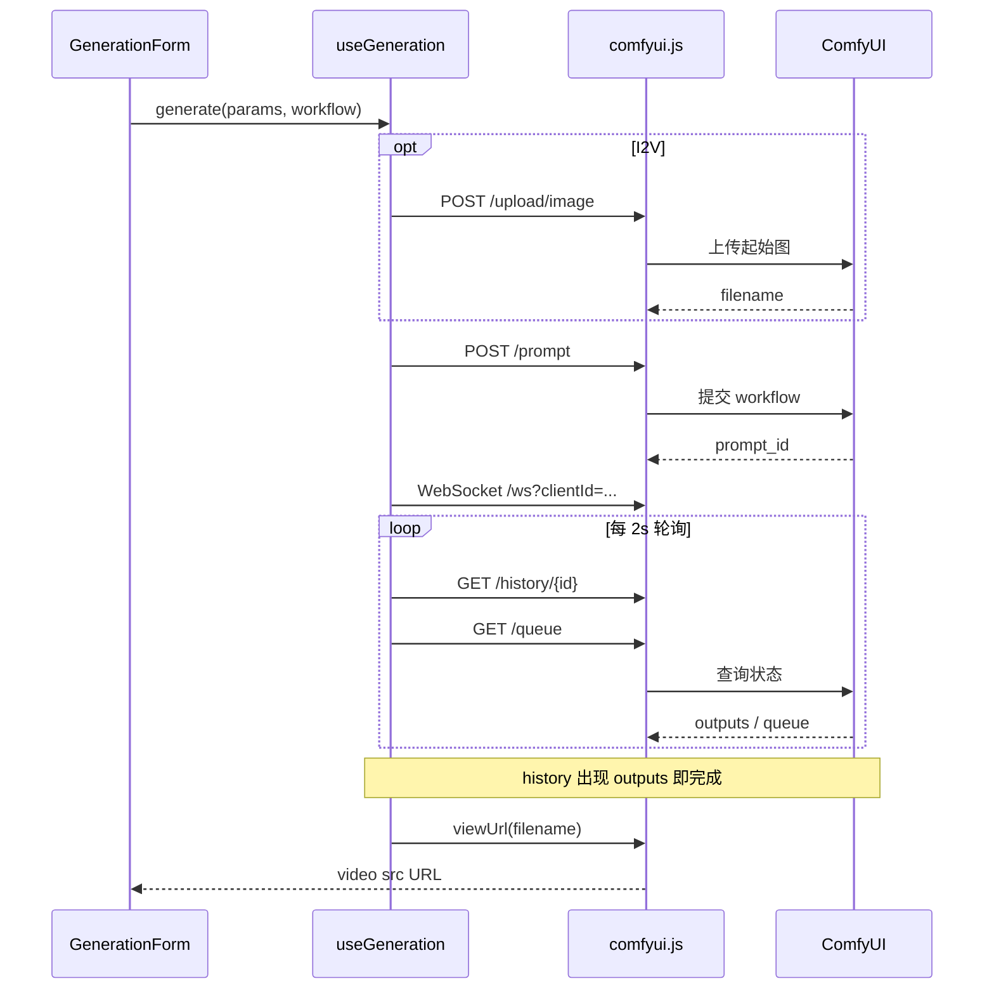

# wan22-demo 与 ComfyUI / 后端 API 技术文档

> **2026-07 更新**：生产路径为 **FastAPI REST**（[`backend/`](../backend/)）。  
> 前端经 [`frontend/src/services/api.js`](../frontend/src/services/api.js) 调用 `/v1/videos/*`、`/v1/media/*`，由后端再访问 ComfyUI。  
> 下文「直连 ComfyUI」仅作底层参考；日常开发请看 [backend/README.md](../backend/README.md)。

## 0. 当前推荐架构

```
浏览器 (Vue 3)
    │  /v1/videos/* 、 /v1/media/* 、 /v1/characters
    ▼
Vite proxy → FastAPI (:8190)
    │
    ├─ ComfyUI (:8188)   视频生成
    └─ Python media      抽帧 / 拼接 / 质检
```

| 入口 | 说明 |
|------|------|
| `POST /v1/videos/t2v|i2v|flf2v` | 提交生成任务 |
| `GET /v1/videos/tasks/{id}` | 轮询任务状态 |
| `GET /health` | 后端健康检查（前端连接指示） |
| `POST /v1/media/upload` | 上传图片到 ComfyUI input |
| `GET /v1/media/view` | 代理 ComfyUI `/view` |

前端封装：`api.js`（生成/轮询/媒体）、`orchestrator.js`（短剧辅助函数，内部走 REST）。
媒体处理已全部为 Python（`backend/app/services/` + `backend/scripts/`），不再依赖 Node。

---

# 附录：ComfyUI 原生接口（底层）

本文档附录描述 ComfyUI HTTP / WebSocket 接口。**前端默认不再直连这些接口。**

## 1. 架构概览（历史直连）

```
浏览器 (Vue 3) ──已废弃直连──► ComfyUI (:8188)
                     │
                     ▼
              现改为经 FastAPI REST
```

- **现封装**：[`frontend/src/services/api.js`](../frontend/src/services/api.js)
- **开发代理**：[`frontend/vite.config.js`](../frontend/vite.config.js)（`/v1`、`/health` → FastAPI）

---

## 2. 接口总览

| 接口 | 方法 | 是否实际调用 | 调用场景 | 封装函数 |
|------|------|-------------|----------|----------|
| `/system_stats` | GET | 是 | 页面加载时检测 ComfyUI 是否在线 | `App.vue` 直接 `fetch` |
| `/upload/image` | POST | 是 | I2V 上传起始图 | `uploadImage()` |
| `/prompt` | POST | 是 | 提交工作流任务 | `queuePrompt()` |
| `/history/{prompt_id}` | GET | 是 | 轮询任务结果、提取输出文件 | `getHistory()` |
| `/queue` | GET | 是 | 轮询排队/运行状态 | `getQueue()` |
| `/view` | GET | 是 | 预览/下载生成的视频 | `viewUrl()` |
| `/ws?clientId=...` | WebSocket | 是 | 实时进度（辅助通道） | `connectProgress()` |
| `/interrupt` | POST | 已封装未使用 | 中断当前任务 | `interrupt()` |
| `/api/*` | — | 否 | 仅代理配置，前端未调用 | — |
| `/object_info` | — | 否 | 仅代理配置，前端未调用 | — |

---

## 3. 各接口说明

### 3.1 GET `/system_stats` — 健康检查

**用途**：右上角显示「后端已连接 / 未连接」。

**调用位置**：[`frontend/src/App.vue`](../frontend/src/App.vue) `checkConnection()` → `GET /health`（FastAPI）

> 历史：曾用 ComfyUI `GET /system_stats`。

**请求**：
```http
GET /system_stats
```

**响应**：HTTP 200 表示 ComfyUI 可达；非 200 或网络错误视为离线。

---

### 3.2 POST `/upload/image` — 上传图片

**用途**：图生视频 (I2V) 将用户选择的起始图上传到 ComfyUI `input/` 目录，拿到文件名后写入 workflow 的 `LoadImage` 节点。

**调用位置**：
- [`src/composables/useGeneration.js`](../src/composables/useGeneration.js)（I2V 模式）

**请求**：
```http
POST /upload/image
Content-Type: multipart/form-data
```

| 字段 | 类型 | 说明 |
|------|------|------|
| `image` | File | 图片文件 |
| `subfolder` | string | 可选子目录 |
| `overwrite` | `"true"` | 同名覆盖 |

**响应示例**：
```json
{
  "name": "example.png",
  "subfolder": "",
  "type": "input"
}
```

**封装返回**：`{ name: "example.png", raw: {...} }`；若有 subfolder 则 `name` 为 `subfolder/filename`。

---

### 3.3 POST `/prompt` — 提交工作流

**用途**：核心接口。将 API 格式 workflow JSON 提交到 ComfyUI 执行队列。

**调用位置**：
- [`src/composables/useGeneration.js`](../src/composables/useGeneration.js) — T2V / I2V 单次生成
- [`src/composables/useMultiShotGeneration.js`](../src/composables/useMultiShotGeneration.js) — 多分镜串行（每段一次）

**请求**：
```http
POST /prompt
Content-Type: application/json
```

```json
{
  "prompt": {
    "6": {
      "class_type": "CLIPTextEncode",
      "inputs": { "text": "一只橘猫…", "clip": ["39", 0] }
    },
    "5": {
      "class_type": "EmptyHunyuanLatentVideo",
      "inputs": { "width": 832, "height": 480, "length": 81, "batch_size": 1 }
    }
  },
  "client_id": "xxxxxxxx-xxxx-4xxx-yxxx-xxxxxxxxxxxx"
}
```

| 字段 | 说明 |
|------|------|
| `prompt` | API 格式节点图，键为节点 id，值含 `class_type` + `inputs` |
| `client_id` | 客户端 UUID，与 WebSocket 关联，用于接收该客户端的进度推送 |

**workflow 来源**：
- 模板：[`src/workflows/`](../src/workflows/) 下的 `*.api.json`
- 参数注入：[`src/services/workflow.js`](../src/services/workflow.js) 的 `buildT2V()` / `buildI2V()`

**成功响应**：
```json
{
  "prompt_id": "a1b2c3d4-e5f6-7890-abcd-ef1234567890",
  "number": 3,
  "node_errors": {}
}
```

**失败响应**：HTTP 4xx/5xx，`error.message` 或 `node_errors` 含节点级错误信息。

---

### 3.4 GET `/history/{prompt_id}` — 查询任务历史

**用途**：
1. 判断任务是否完成
2. 从 `outputs` 提取 `SaveVideo` 等节点产出的文件名
3. 检测 `execution_error`

**调用位置**：`getHistory()` → `waitForResult()` 轮询循环

**请求**：
```http
GET /history/{prompt_id}
```

**响应结构（节选）**：
```json
{
  "a1b2c3d4-...": {
    "outputs": {
      "10": {
        "gifs": [
          {
            "filename": "Wan2.2_t2v_00001.mp4",
            "subfolder": "video",
            "type": "output"
          }
        ]
      }
    },
    "status": {
      "status_str": "success",
      "completed": true,
      "messages": []
    }
  }
}
```

**前端解析**：[`extractMediaFromHistory()`](../src/services/workflow.js) 遍历 `outputs` 下所有数组字段（兼容 `images` / `gifs` / `videos` 等键），按扩展名区分 video/image。

---

### 3.5 GET `/queue` — 查询执行队列

**用途**：判断 `prompt_id` 是否在排队或运行中，用于 UI 显示「排队中 / 生成中」及队列位置。

**调用位置**：`getQueue()` → `waitForResult()` 轮询循环

**请求**：
```http
GET /queue
```

**响应结构（节选）**：
```json
{
  "queue_running": [
    [序号, "prompt_id", {}, ["client_id"]]
  ],
  "queue_pending": [
    [序号, "prompt_id", {}, ["client_id"]]
  ]
}
```

**前端逻辑**：
- `isPromptInQueue()` — 判断 prompt 是否在 running / pending
- `getQueuePosition()` — 返回在 pending 中的位置（从 1 开始）

---

### 3.6 GET `/view` — 获取输出文件

**用途**：根据 history 返回的 `filename` / `subfolder` / `type` 拼 URL，供 `<video src>` 播放和下载链接。

**调用位置**：
- `useGeneration.js` `finish()` 
- `useMultiShotGeneration.js` 每段完成后

**请求**：
```http
GET /view?filename=Wan2.2_t2v_00001.mp4&subfolder=video&type=output
```

| 参数 | 说明 |
|------|------|
| `filename` | 文件名 |
| `subfolder` | 子目录（如 `video`） |
| `type` | 通常为 `output` |

**封装**：`viewUrl({ filename, subfolder, type })` 返回完整 URL 字符串。

---

### 3.7 WebSocket `/ws?clientId={uuid}` — 实时进度

**用途**：辅助通道，接收采样进度、当前执行节点、执行错误。任务**完成判定不依赖 WS**，以 `/history` 轮询为准。

**调用位置**：`connectProgress()`，由 `useGeneration` / `useMultiShotGeneration` 在提交 prompt 后建立连接。

**连接 URL**（开发期）：
```
ws://localhost:5173/ws?clientId=xxxxxxxx-xxxx-4xxx-yxxx-xxxxxxxxxxxx
```

**前端处理的消息类型**：

| `type` | 含义 | 处理 |
|--------|------|------|
| `progress` | 单节点采样进度 | `value` / `max` / `node` → 进度条 |
| `progress_state` | 多节点汇总进度 | `aggregateProgressState()` 汇总后更新进度条 |
| `executing` | 当前执行节点 | 更新「节点 xxx」提示 |
| `executed` | 某节点执行完毕 | 可选回调 |
| `execution_error` | 执行异常 | 触发 `onError` |
| `status` | 队列状态变更 | 可选回调 |

**重连**：WS 断开后每 2 秒自动重连（排队期间代理可能断开）。

---

### 3.8 POST `/interrupt` — 中断任务（已封装未接入 UI）

**用途**：中断 ComfyUI 当前正在执行的任务。

**封装**：`interrupt()` 存在于 `comfyui.js`，当前 UI **未提供「取消」按钮**，故实际未调用。

---

## 4. 完整调用时序

### 4.1 文生视频 (T2V) / 图生视频 (I2V)



### 4.2 多分镜 30s（6 段串行）

与 T2V 相同，但对每段分镜**重复**提交视频任务，共 6 次。拼接成片在服务端用 Python `concat_video` / `scripts/concat_xfade.py` 调用 ffmpeg，**不经过 ComfyUI API**。

---

## 5. 轮询与超时策略

`waitForResult()` 是任务完成的核心逻辑：

| 参数 | 默认值 | 说明 |
|------|--------|------|
| `intervalMs` | 2000 | 轮询间隔 |
| `timeoutMs` | 7200000 (2h) | 总超时 |

各模式实际超时（由调用方传入）：

| 模式 | timeoutMs |
|------|-----------|
| 普通 T2V/I2V | 默认 2 小时 |
| LightX2V 5s | 10 分钟 |
| 单次 30s | 30 分钟 |
| 多分镜每段 | 10 分钟 |

**完成条件**：`extractMediaFromHistory()` 返回非空数组（找到带 `filename` 的输出）。

**失败条件**：
- `status.status_str === 'error'`
- 任务离开队列但连续 5 次 history 仍无输出
- 超过 `timeoutMs`

---

## 6. 开发代理配置

[`vite.config.js`](../vite.config.js) 将以下路径代理到 `COMFYUI_HOST`（默认 `http://127.0.0.1:8188`）：

```
/prompt  /history  /view  /upload  /api
/queue   /interrupt  /object_info  /system_stats
/ws (WebSocket)
```

**注意**：HTTP 代理会移除 `Origin` 头，避免 ComfyUI CSRF 校验导致 403（Host 与 Origin 不一致）。

生产环境若前端与 ComfyUI 不同源，需：
1. 修改 [`src/config.js`](../src/config.js) 中 `BASE_URL` 为 ComfyUI 地址
2. ComfyUI 启动加 `--enable-cors-header`

---

## 7. 代码索引

| 功能 | 文件 |
|------|------|
| 接口封装 | `src/services/comfyui.js` |
| Workflow 参数注入 | `src/services/workflow.js` |
| 单次生成状态机 | `src/composables/useGeneration.js` |
| 多分镜串行生成 | `src/composables/useMultiShotGeneration.js` |
| 连接检测 | `src/App.vue` |
| 地址 / WS | `src/config.js` |
| 开发代理 | `vite.config.js` |

---

## 8. 未使用的 ComfyUI 能力

当前前端**未调用**但 ComfyUI 通常还提供：

- `GET /object_info` — 查询节点类型与输入 schema
- `POST /queue` — 清空队列
- `GET /history`（无 prompt_id）— 全部历史
- `POST /free` — 释放显存
- 自定义 API 节点

若后续要做「动态加载节点参数」「取消任务」「显存管理」等，可在此基础上扩展。
